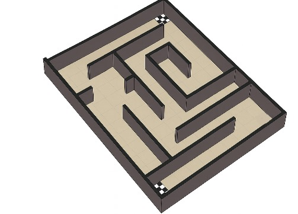
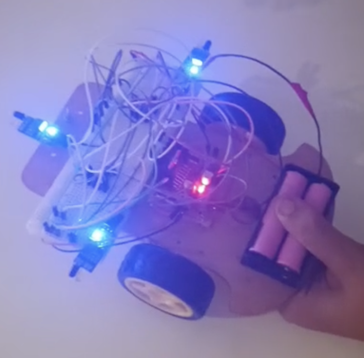

# Maze-Solving Car — Digital Logic Design

An autonomous maze-solving robot built using discrete ICs and an Arduino, designed and implemented as part of the *Digital Logic and Design* course at IBA Karachi (Fall 2025).

The car navigates a physical maze autonomously using the **Right Wall Following Algorithm**, implemented as a minimized combinational logic circuit derived from a truth table and Karnaugh maps.

---

## How It Works

Three IR sensors feed binary signals (wall = 0, no wall = 1) into a combinational circuit. The circuit outputs control signals to an L298N motor driver, which steers the car accordingly.

### Sensors
| Sensor | Label | Description |
|--------|-------|-------------|
| Left   | A     | Detects wall on the left |
| Front  | B     | Detects wall ahead |
| Right  | C     | Detects wall on the right |

### Algorithm — Right Wall Following
The car always tries to keep a wall on its right. Decision priority:

| A (Left) | B (Front) | C (Right) | Action   |
|----------|-----------|-----------|----------|
| 0        | 0         | 0         | U-turn (left side) |
| 0        | 0         | 1         | Turn Right |
| 0        | 1         | 0         | Go Straight |
| 0        | 1         | 1         | Turn Right |
| 1        | 0         | 0         | Turn Left |
| 1        | 0         | 1         | Turn Right |
| 1        | 1         | 0         | Go Straight |
| 1        | 1         | 1         | Turn Right |

> U-turn is performed from the **left side** to give the car enough physical space to complete the turn.

---

## Logic Design

Motor driver inputs (IN1–IN4) were derived using **Karnaugh map minimization**:

| Output | Boolean Expression |
|--------|--------------------|
| IN1    | B + C              |
| IN2    | A' · B' · C'       |
| IN3    | C'                 |
| IN4    | 0 (always off)     |

The minimized expressions were implemented using standard logic gate ICs (AND, OR, NOT) on a breadboard, feeding directly into the L298N motor driver.

---

## Hardware Components

- Arduino (sensor reading & signal interface)
- 3× IR sensors (left, front, right)
- L298N Motor Driver
- 2× DC motors
- Logic gate ICs (AND, OR, NOT)
- Custom-built physical maze

---

## Team

- Anser Abbas
- Muhammad Shayan Naveed
- Muhammad Hasnain Raza
- Jawad Hussain
- Sudheer Rathore

*IBA Karachi · Digital Logic and Design · Fall 2025*
